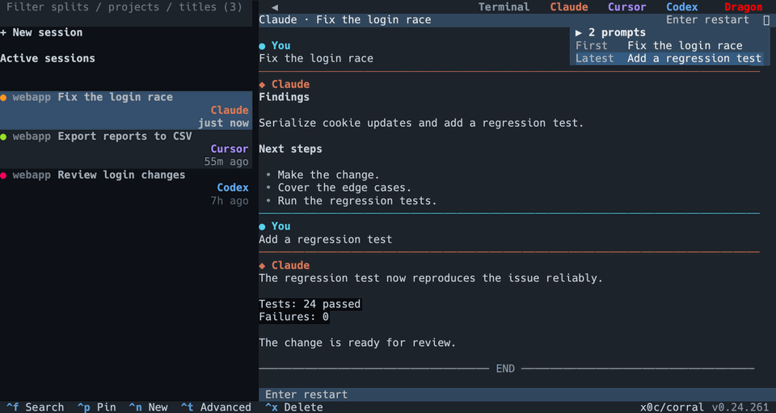
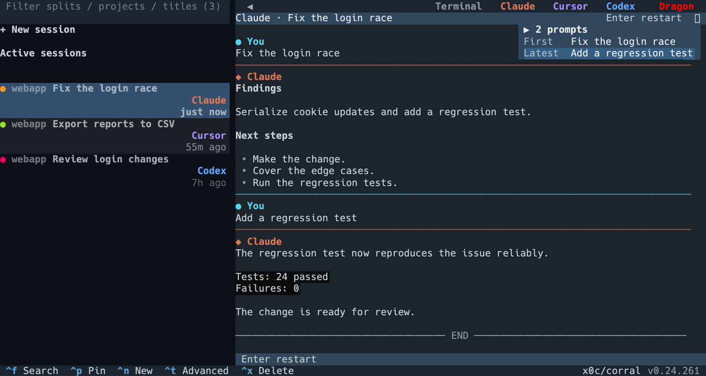
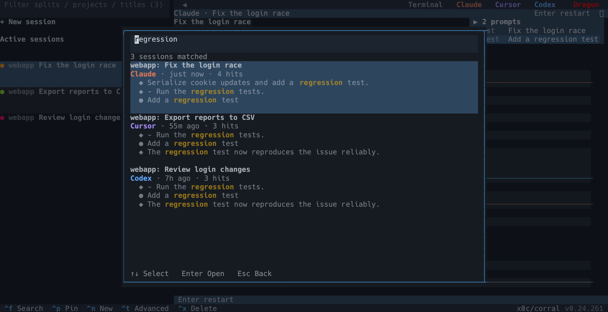

**Languages:** English | [简体中文](README.zh-CN.md)

<p align="center">
  
</p>
<h1 align="center">Corral</h1>
<p align="center"><strong>Run all your coding agents from one terminal — and pick them up from your phone.</strong></p>
<p align="center">Claude Code, Codex, OpenCode, Cursor, and Pi side by side. See which agent needs you, open several sessions together, and keep hosted agents running when you close the workspace.</p>

<p align="center">
  <a href="https://github.com/corral-dev/corral/releases/latest"></a>
  <a href="https://github.com/corral-dev/corral/actions/workflows/test.yml"></a>
  <a href="LICENSE"></a>
</p>

<p align="center">
  
</p>
<p align="center"><em>One sidebar for your agents. Read a conversation or open sessions side by side.</em></p>

<p align="center">
  
</p>

## Choose what to install

| Part | What it does | Status |
| --- | --- | --- |
| **[Terminal app](https://github.com/corral-dev/corral)** | Run, watch, and switch between all your coding agents in one terminal. | Available — install below |
| **[iPhone and Mac app](https://github.com/corral-dev/corral-apple)** | Follow your agents and answer them away from the terminal. | Source beta · self-build with Xcode |
| **[Relay](https://github.com/corral-dev/corral-relay)** | Connect your host and clients across networks. | Self-hosted · AGPL-3.0-only |
| **Corral Ideas** | Jot loose ideas on one local page; a coordinating agent turns them into tasks and hands them to coding agents. | Planned |

## Install

On **macOS or Linux with Homebrew**:

```bash
brew install x0c/tap/corral
corral
```

Use the full tap name: `brew install corral` installs an unrelated project. Homebrew installs Python and tmux for you.

<details>
<summary>Without Homebrew</summary>

Install **Python 3.10+** and **tmux 3.2+**, then run:

```bash
curl -fsSL https://raw.githubusercontent.com/corral-dev/corral/main/install.sh | bash
corral
```

Follow the installer's PATH instructions if your terminal cannot find `corral`. A source-build fallback requires Rust.

</details>

Install and sign in to at least one supported coding assistant separately. Corral is free and MIT-licensed; the assistants use their own accounts and may incur charges. **Windows and WSL are not supported.**

## What Corral does

- **See who needs you.** Working agents and agents waiting on your answer show up in one sidebar, across every assistant.
- **Work side by side.** Open up to four sessions together, group related work, and pin what matters.
- **Keep agents running.** Hosted sessions keep going after you close Corral or disconnect SSH, as long as the host stays awake.
- **Hand work to another assistant.** Pass a task with its conversation history to a new session in a different assistant — for example, Claude implements and Codex reviews.
- **Continue from your phone.** Read replies, send a follow-up, or answer a question away from your desk. Self-build the Apple client; see below.
- **Find past conversations.** Search what you said across every assistant's history, or filter by project and title.

## Start using it

Open `corral`. Existing assistant sessions appear in the sidebar. Selecting a conversation reads it; it does not start that assistant. Press `Enter` to resume an ended session or attach to a hosted terminal.

Press `Ctrl+N` to start something new. From your shell you can also choose the assistant:

```bash
corral claude
# Also: corral codex | corral opencode | corral cursor | corral pi
```

Select two to four sessions with `Space`, then press `Enter` to open them side by side. Closing a pane hides that view; it does not stop a hosted agent.

To continue elsewhere, open a session, press `Ctrl+T`, and choose an assistant. After Claude finishes an implementation, you can hand that conversation to Codex for review. The source session stays intact; the receiving assistant reads the history it needs. Press `Enter` instead when you want the original assistant's native resume.

Press `Ctrl+\` to return keyboard control to the sidebar. Quitting Corral leaves hosted agents running.

Corral launches supported assistants with their automatic-approval modes enabled where available. Those agents can act with your local user permissions.

### Keys to remember

| Key | Action |
| --- | --- |
| `/` | Filter projects and session titles |
| `Ctrl+F` | Search conversation text |
| `Enter` | Resume or enter the selected session |
| `Ctrl+N` | Start a new session |
| `Space`, then `Enter` | Select two to four sessions and split the view |
| `Ctrl+T` | Export, copy, or hand off a session |
| `Ctrl+\` | Return input to the sidebar |
| `Esc` | Close the current dialog or quit |

Sidebar shortcuts apply while the sidebar has focus. The footer shows actions available in the current view.

<details>
<summary>Search by what you said</summary>



</details>

## Pick up from your phone

Leave the desk and keep your agents moving: read conversations, send a follow-up, or answer a question from your iPhone.

**[Apple client source](https://github.com/corral-dev/corral-apple) is available for self-building with Xcode.** Installing the CLI does not install the companion app; a public App Store or TestFlight download is not available yet.

With the Apple client installed, run this on the machine hosting your agents:

```bash
corral remote pair
```

Pairing starts remote access and installs any missing remote components. Scan the code in the Apple client on the same local network. Away from home, you need a relay you host yourself; Corral does not bundle a shared public relay. Phone traffic is end-to-end encrypted. For access across networks, follow the [relay setup](https://github.com/corral-dev/corral-relay#quick-start). Use `corral remote pair --readonly` when a device should only view sessions.

## Privacy

- Session browsing and search read local assistant history.
- Optional title generation may send short excerpts to a configured language-model gateway and can consume quota there.
- Update checks contact GitHub.
- Pairing a phone authorizes it to access and act on your sessions; remote traffic is end-to-end encrypted.

See the [privacy policy](PRIVACY.md) for data flows and controls.

## For scripts and coding agents

```bash
corral list --top 10 --compact
corral search "login" --deep
corral show <session-id-prefix> --messages 10 --compact
```

See the [command reference](docs/SKILL.md) for JSON output, export, and handoff planning.

## Help and contribute

- [Command reference](docs/SKILL.md) — CLI usage and automation
- [Terminal guide](docs/TERMINAL_UI_KNOWLEDGE_BASE.md) — panes, groups, focus, and shortcuts
- [Remote guide](docs/REMOTE_KNOWLEDGE_BASE.md) — phone pairing and self-hosted access
- [Contributing](CONTRIBUTING.md) — development and pull requests
- [Report a bug or suggest an improvement](https://github.com/corral-dev/corral/issues/new/choose) — include your OS, terminal, Corral version, and steps to reproduce. Remove private conversation content from reports.

If Corral fits your workflow, star the repository to find it again.

[MIT License](LICENSE)
